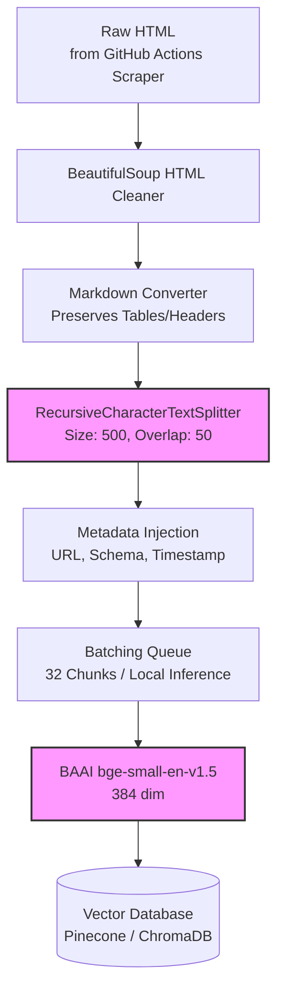

# Chunking and Embedding Architecture

## 1. Overview
This document details the specific strategies and technical flows for processing scraped HTML data into vectorized chunks for the Mutual Fund FAQ Assistant. The goal is to maximize factual retrieval accuracy, maintain context, and preserve critical tabular data (like Expense Ratios and Exit Loads).

## 2. Chunking Strategy

### 2.1 HTML Parsing & Normalization
The scraped HTML data from Groww URLs contains significant noise (navbars, footers, scripts). 
* **Cleaning Pipeline**: The raw HTML is parsed using tools like `BeautifulSoup` to extract only the main content body.
* **Markdown Conversion**: Tabular data, lists, and headers are converted into Markdown format. This is critical because standard text splitters can destroy data grids. Markdown preserves the visual layout of tables within the text chunks.

### 2.2 Semantic Chunking
Once in raw Markdown format, the document is processed using LangChain's `RecursiveCharacterTextSplitter`.
* **Chunk Size**: **~500 tokens**. This size is large enough to capture the full context of a mutual fund's sub-topic (e.g., "Tax Implications" or "Risk Metrics") without diluting the semantic meaning during similarity search.
* **Overlap**: **50 tokens**. An overlap ensures that sentences or facts cut at chunk boundaries do not lose adjacent context.
* **Separators**: The system attempts to split the text sequentially based on logical document boundaries:
  1. `\n\n` (Paragraphs / Headers)
  2. `\n` (Lines)
  3. ` ` (Spaces)
  *Note: Custom logic ensures that Markdown tables are never split aggressively across rows, keeping the table context together within a chunk wherever possible.*

---

## 3. Metadata Attachment
Before vectorization, each chunk is infused with structured metadata. This allows the Retrieval step to filter reliably (e.g., hybrid search) and guarantees that the final generation can precisely cite the data source.

* `chunk_id`: Unique UUID for the chunk.
* `source_url`: The Exact Groww URL from which the data was scraped.
* `scheme_name`: Identified from the `<h1>` or title tags of the snippet.
* `last_updated`: The timestamp when the GitHub Actions bot scraped the data.
* `is_tabular`: A boolean flag if the chunk contains a markdown table.

---

## 4. Embedding Strategy

### 4.1 Embedding Generation
* **Model Choice**: BAAI's `bge-small-en-v1.5` via local SentenceTransformers.
* **Dimensions**: Outputs dense vectors of `384` dimensions. This open-source model provides extremely fast, high-quality semantic retrieval perfectly suited to english environments at zero cost.

### 4.2 Batch Processing
* **Batching**: To optimize local GPU/CPU compute execution time, chunks are accumulated into memory arrays and processed iteratively in **batches of 32**.

---

## 5. Vector Database Storage

* **Database Engine**: Pinecone (Serverless) or ChromaDB.
* **Indexing Strategy**: HNSW (Hierarchical Navigable Small World) for sub-millisecond retrieval latency.
* **Hybrid Storage (Optional but Recommended)**: The database is configured to store the Dense Vectors (from OpenAI) alongside **Sparse Vectors (BM25)**. This enables Hybrid Search, allowing the system to weigh exact keyword matches ("NAV", "ELSS") heavily alongside general semantic intent ("How much does this fund cost?").

---

## 6. End-to-End Pipeline Diagram

