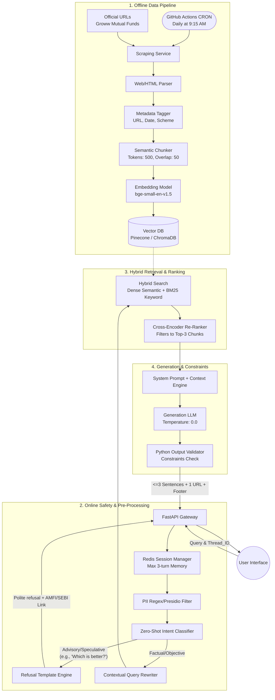

# Comprehensive RAG Architecture: Mutual Fund FAQ Assistant

## 1. Executive Summary & Design Principles
The Mutual Fund FAQ Assistant is a specialized Retrieval-Augmented Generation (RAG) agent engineered specifically for **strict factual accuracy and compliance**. The architecture adheres to the following core principles:
* **Facts-Only & Compliance First:** Absolutely zero tolerance for predictions, opinions, or investment advice.
* **Deterministic Output:** Generation settings (e.g., Temperature = `0.0`) suppress hallucinations alongside strict system prompting.
* **Absolute Traceability:** Every factual response is linearly traceable back to a specific corpus chunk, accompanied by a single source URL and an explicit footer timestamp.
* **Stateless PII Protection:** PII (PAN, Aadhaar) is filtered pre-flight, and no user data is logged or processed.

---

## 2. End-to-End System Architecture



---

## 3. Data Corpus & Metadata Schema
The vector knowledge base is derived strictly from the following URLs. Third-party blogs or aggregators are explicitly excluded. Currently, **no PDFs will be provided**.

**In-Scope URLs:**
* https://groww.in/mutual-funds/sbi-magnum-multiplier-fund-direct-growth
* https://groww.in/mutual-funds/sbi-small-midcap-fund-direct-growth
* https://groww.in/mutual-funds/sbi-flexicap-fund-direct-growth
* https://groww.in/mutual-funds/sbi-large-cap-direct-plan-growth
* https://groww.in/mutual-funds/sbi-elss-tax-saver-fund-direct-growth

**Metadata JSON Schema:** 
Every vectorized text chunk must embed metadata to fulfill output constraints:
```json
{
    "chunk_id": "uuid-1234",
    "source_url": "https://groww.in/mutual-funds/sbi-magnum-multiplier-fund-direct-growth",
    "document_type": "Webpage",
    "scheme_name": "Axis ELSS Tax Saver",
    "last_updated": "2023-10-01",
    "is_tabular": true
}
```

---

## 4. Ingestion & Preservation Pipeline

This phase manages the extraction, processing, and indexing of raw data into the knowledge base, ensuring the RAG agent has access to fresh, high-quality, and properly structured facts.

* **1. Scheduler & Scraping (orchestration + extraction):**
  * **Trigger:** A **GitHub Actions CRON workflow** initiates the ingestion job daily at **9:15 AM** to synchronize with regular update cycles.
  * **Execution:** Containerized or serverless Python scripts run the pipeline, iterating over the configured source lists.
  * **Resilience:** Built-in retry mechanisms (exponential backoff) handle intermittent network failures, with automated alerting if the scraping jobs permanently fail.
  * **Configured Endpoints:** Connects exclusively to whitelisted canonical URLs (e.g., specific Groww mutual fund direct growth pages).
  * **Fetch Strategy:** Employs headless browsing or HTTP clients (e.g., `httpx` with `BeautifulSoup`) to extract core page content. Implements rate-limiting to gracefully interact with destination servers.
  * **Content Cleaning & Markdown Conversion:** Aggressively strips irrelevant HTML nodes like navbars, footers, and scripts. Converts the essential factual content (especially HTML tables) into clean, preserved Markdown to retain structural relationships.

* **2. Normalize (deduplication + metadata tagging):**
  * To optimize token usage and compute costs, scraped pages are hashed (e.g., SHA-256) upon retrieval.
  * The ingestion engine compares new payload hashes against the previously stored versions. 
  * **Upsert Only:** If the document hash hasn't changed, the pipeline skips chunking/embedding. Only fresh, completely new, or modified content triggers down-stream vector ingestion.
  * As pages are processed, a parser dynamically grabs critical facts to fulfill the required metadata schema (extracting the semantic `scheme_name`, the exact `source_url`, and the `last_updated` date).
  * This ensures every chunk carries its lineage, meeting the strict requirement for output URL citations.

* **3. Chunk & Embedding (chunking strategy + vectorization):**
  * **Methodology:** The cleaned Markdown is systematically segmented using a `RecursiveCharacterTextSplitter`.
  * **Size Configuration:** Tuned to **~500 tokens with a 50-token window overlap**. This threshold guarantees that individual multi-sentence facts remain intact across boundaries and the LLM receives dense, focused contexts without dilution.
  * **Embedding Model:** Contextual chunks pass through the `bge-small-en-v1.5` model via local SentenceTransformers to generate rich semantic vector arrays.

* **4. Vector & Index (indexing + storage):**
  * **Vector DB Storage:** Finally, vectors and their associated metadata payloads are actively written (upserted) into the Vector DB (Pinecone/ChromaDB), refreshing the HNSW indices for sub-millisecond retrieval.

---

## 5. Retrieval Strategy
Retrieving deep financial jargon requires overlapping methodologies:
1. **Context-Aware Query Rewriting:** Maps session history (e.g., "What is its NAV?") into a standalone search term (e.g., "What is the NAV for Axis ELSS?").
2. **Hybrid Search:** Combines **Dense Retrieval** (understanding intent) and **BM25 Sparse Retrieval** (perfectly matching exact keywords or acronyms like "ELSS"). Retrieves Top-15 candidates.
3. **Cross-Encoder Re-Ranking:** The Top-15 chunks pass through a re-ranker (e.g., Cohere `rerank-v3.0`), elevating the 3 most profoundly factual chunks to pass to the LLM.

---

## 6. Security, Compliance & Refusal Layer
Every query traverses strict programmatic blocks before accessing the database.
* **PII Redaction:** Fast Regex sweeps drop any payloads containing PAN formats (`[A-Z]{5}[0-9]{4}[A-Z]{1}`), Aadhaar, emails, or phone numbers.
* **Intent Classifier:** A rapid zero-shot classifier intercepts the string:
  * *Condition:* If classified as **Subjective, Comparison, or Advice**, the request is immediately dropped.
  * *Action:* The system responds with a hardcoded template: *"I can only provide verified factual data. For investment advice, please consult a registered advisor. Facts-only. No investment advice."* alongside a link to AMFI educational materials.

---

## 7. Generation Engine & Constraint Validation
* **Prompt Engineering:** Commands dictate that the LLM must *only* use provided Contexts and must never compute math (e.g., 3-year trailing ROI calculation). If context is missing, it must output a hardcoded "Information not found" fallback.
* **Constraint Validation Gate:** A Python formatting engine intercepts the final LLM text before returning it to the user. It asserts the following problem statement rules:
  1. Counts sentences (Must be `<=` 3).
  2. Extracts the `source_url` from the retrieved chunk and appends it uniquely.
  3. Formats and appends: `Last updated from sources: <date>`.

---

## 8. User Interface (Minimalist)
The front-end (built with Streamlit or React) strictly conforms to the expected deliverables:
* **Disclaimer Header:** Prominently displays: `"Facts-only. No investment advice."` on every screen.
* **Onboarding Space:** Contains a clear welcome message alongside 3 clickable example factual queries (e.g., *"What is the exit load for Axis ELSS?"*).
* **Multi-Thread Support:** Utilizes UUID-based tabs or sidebars so the user can manage multiple, isolated chat threads concurrently without polluting the short-term memory scope.

---

## 9. API Specifications
| Endpoint | Method | Purpose |
| --- | --- | --- |
| `/api/v1/session/init` | `POST` | Allocates a new UUID Thread for multi-chat support. |
| `/api/v1/chat/query` | `POST` | Accepts query/UUID. Processes RAG flow, returns exact 3 sentences. |
| `/api/v1/admin/ingest` | `POST` | Triggers AMC URL crawling and Vector DB embedding job. |
| `/api/v1/health` | `GET` | Readiness probes for DB and LLM response latency. |

---

## 10. Technology Stack Mapping
| Layer | Tech Recommendation | Open-Source / Local Alternative |
| --- | --- | --- |
| **Frontend UI** | Streamlit | Next.js |
| **App Framework** | FastAPI + LangChain | Flask |
| **Parser Engine** | LlamaParse (High accuracy for tables) | Unstructured.io / PyMuPDF |
| **Embeddings** | BAAI `bge-small-en-v1.5` (Local) | N/A |
| **Vector DB** | Pinecone (Cloud Managed) | ChromaDB (Local) |
| **Re-Ranker** | Cohere `rerank-english-v3.0` | `cross-encoder/ms-marco-MiniLM` |
| **Generator LLM** | OpenAI `gpt-4o-mini` | Anthropic `Claude-3-haiku` |
| **Tracker & Eval** | LangSmith (Telemetry), Ragas | Arize Phoenix |

---

## 11. Known Limitations & Mitigations

1. **Calculations & Projections:** The system intentionally lacks mathematical evaluation capabilities. Queries like *"If I invest 5000 in this SIP what will it be?"* trigger a refusal prompt directing them to the factsheet link.
2. **Real-time NAV Staleness:** The agent cannot scrape live tickers per second. The NAV corresponds precisely to the `last_updated` date of the PDF ingested, ensuring users always see the correct timestamp of the data.
3. **Empty Source Mapping:** To completely dismantle hallucinated "helpful guessing", if the vector DB returns chunks below a similarity threshold (e.g., `< 0.70`), the LLM defaults to the "I do not have this factual information" fallback.
